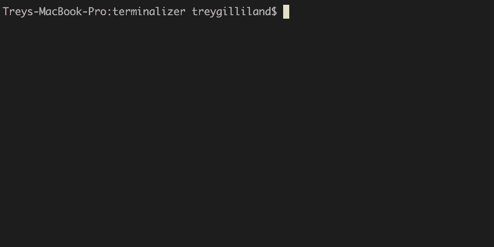

# zootype



Terminal-based typing test to improve your typing speed without context-switching from your IDE.

## Overview

`zootype` is a suite of terminal-based typing test implementations, each written from scratch in a different programming language.
`gophertype` is the first and default implementation, with more coming soon.

**Features:**

- Color-coded real-time feedback
- Typing test metrics (wpm, accuracy, etc.)
- Configurable via CLI flags
- Alternate terminal buffer to keep your history clean
- Works in any terminal that supports ASCII + ANSI color codes

## Installation

Each language implementation can be installed separately via Homebrew:

```bash
# Install gophertype (Go implementation)
brew install treygilliland/tap/gophertype
gophertype

# More coming soon...
```

## Usage

### gophertype

Basic usage with defaults (30 second timed mode with random words):

```bash
gophertype
```

**Mode Selection (mutually exclusive):**

- `-t, --time <N>` - Timed mode: type for N seconds (default: 30)
- `-w, --words <N>` - Word count mode: complete N words, untimed

**Text Options:**

- `-s, --source <TYPE>` - Text source: `words` or `sentences` (default: words)

**Other:**

- `-v, --version` - Print version information
- `-h, --help` - Show usage information

**Examples:**

```bash
gophertype                  # default: 30 second timed mode with words
gophertype -t 15            # 15 second timed mode
gophertype -w 50            # type 50 words, untimed
gophertype -s sentences     # use sentences instead of words
gophertype -t 60 -s words   # 1 minute test using words
```

**Note:** All future implementations (pythontype, crabtype, etc.) will maintain the same CLI API for consistency.

## Development

### Building

```bash
make            # build all binaries to bin/
make run        # build and run gophertype
make clean      # remove bin/ and build artifacts
```

### Testing Multiple Implementations

Install the `zootype` development wrapper to easily switch between implementations:

```bash
make install    # install zootype wrapper to ~/.local/bin
```

The `zootype` wrapper runs binaries from your local `bin/` directory, so it won't conflict with Homebrew installations:

```bash
zootype -b gophertype     # run bin/gophertype (your dev build)
zootype -b pythontype     # run bin/pythontype (your dev build)
gophertype                # your Homebrew installation (unchanged)
```

To uninstall the wrapper:

```bash
make uninstall  # removes zootype wrapper only
```

### Releases

Each language implementation has independent versioning and releases. To create a release:

**For gophertype:**

```bash
git tag gophertype-v1.0.0
git push origin gophertype-v1.0.0
```

Each tag triggers a separate GitHub Actions workflow that builds and publishes the release for that specific implementation. This allows each implementation to evolve at its own pace with independent version numbers.

## Motivation

I love exploring new programming languages and tinkering with keyboards. I've spent a lot of time on [monkeytype.com](https://monkeytype.com/) and wanted a way to practice typing speed directly from my terminal without context-switching.

The name is a nod to monkeytype and how lots of programming languages have animal mascots. Building the same interactive CLI in multiple languages is a great way to compare:

- How each language handles raw terminal I/O and ANSI escape sequences
- Concurrency models for managing user input and display updates
- String manipulation and real-time character processing
- Performance characteristics (must be responsive for typing)
- Build systems, runtimes, and packaging ecosystems

Each implementation is written without TUI frameworks or third-party dependencies to highlight the "zen" of each language's standard library and idioms.

## Implementation Roadmap

All implementations maintain the same CLI API (flags and behavior) for consistency.

Currently implemented:

- **Go (gophertype)** - Full implementation with all features. Handles raw terminal I/O, escape sequences, and concurrent goroutines for input/display management. Installable via Homebrew.

Coming soon:

- **Python (pythontype)** - In development

### Adding New Implementations

To add a new language implementation:

1. Create a directory for your implementation (e.g., `crabtype/`)
2. Add the language name to `LANGUAGES` in `zootype.sh`
3. Create a `build_<name>()` function in `zootype.sh` with your build commands
4. Create a GitHub Actions workflow in `.github/workflows/release-<name>.yml` for releases
5. Update the `.gitignore` and `Makefile` clean target if needed

Example for Rust:

```sh
# In zootype.sh
LANGUAGES="gophertype pythontype crabtype"

build_crabtype() {
    echo "Building crabtype..."
    cd "$SCRIPT_DIR/crabtype"
    cargo build --release
    rm -f "$BIN_DIR/crabtype"
    cp target/release/crabtype "$BIN_DIR/crabtype"
}
```

See `.github/workflows/release-cameltype.yml` for an example release workflow.

### Coming Soon

- JavaScript/TypeScript (Dinotype)
- Rust (Crabtype)
- OCaml (Cameltype)
- C++ ([Rattype](https://news.ycombinator.com/item?id=44631253))

### Maybe One Day

- Zig (Iguanatype)
- Swift (Swifttype)
  - Swift vs Swallow, [see heated debate here](https://github.com/swiftlang/swift/issues/44791)
- Shell (Eggtype)
- PHP (Elephanttype)
- Elixir (Phoenixtype)
- SQL (Ducktype)
  - Obviously will have to get creative here
- Dart/Flutter (Hummingbirdtype)

These need a better mascot before I consider them:

- Haskell (Lamb(da)type)
- C (Bugtype)
- Java (Duketype)
  - Bean (Spring), Elephant (Gradle), Raven (Maven), Duke -> Devil
- Lisp (Lisptype)
  - Clojure or Janet
- Assembly (Robottype)
